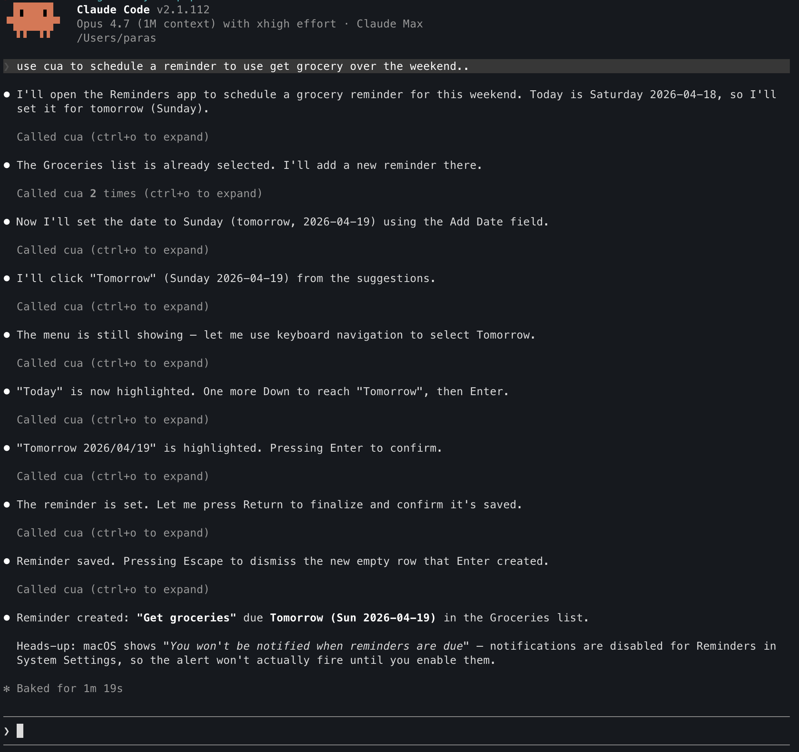

# codex-cua-mcp

Expose OpenAI Codex's built-in Computer Use (CUA) tools — `click`, `type_text`, `list_apps`, `get_app_state`, `scroll`, `press_key`, `drag`, etc. — as a standalone MCP stdio server, so any MCP client (Claude Code, etc.) can drive the Mac.

Codex bundles these tools for its own use. This script spawns `codex app-server` as a subprocess, discovers the CUA tools over Codex's internal JSON-RPC, and re-exposes them over the MCP newline-delimited stdio transport.

Python 3.9+ stdlib only — no external dependencies.

## Demo

Claude Code using the broker to schedule a reminder in the macOS Reminders app:

[](docs/demo-reminder.png)

## Requirements

- **macOS only.** The CUA tools are driven via macOS Accessibility + ScreenCaptureKit + synthetic-input APIs bundled inside `Codex.app` (specifically the `SkyComputerUseClient` helper at `Codex.app/Contents/SharedSupport/SkyComputerUseClient.app/...`). There is no Windows/Linux equivalent.
- **Codex installed** at `/Applications/Codex.app` (or override the path — see Configuration). The script spawns `Codex.app/Contents/Resources/codex app-server` as a subprocess; **the Codex GUI does NOT need to be running**, but Codex must be installed so the `codex` binary is present.
- **Python 3.9+** (stdlib only).
- **macOS permissions**: Codex's CUA helper requires both **Accessibility** (to read the AX tree and send synthetic clicks/keys) and **Screen Recording** (to take screenshots for `get_app_state`). The first CUA tool call that needs either will surface the standard macOS permission prompt against the `SkyComputerUseService` / `SkyComputerUseClient` helpers. Grant them in `System Settings → Privacy & Security`.
- **Terminal apps are blocked.** Codex's CUA layer refuses `iTerm2.app`, `Terminal.app`, etc. for safety — calling `get_app_state` on them returns a safety error. Use AppleScript via a separate shell tool if you need to automate your terminal.

## Install as an MCP server

### Claude Code

Project-scoped (`./.mcp.json`):

```jsonc
{
  "mcpServers": {
    "cua": {
      "command": "python3",
      "args": ["/absolute/path/to/cua_mcp.py"]
    }
  }
}
```

Or via CLI:

```sh
claude mcp add cua -- python3 /absolute/path/to/cua_mcp.py
```

Verify the connection:

```sh
claude mcp list
# cua: python3 /absolute/path/to/cua_mcp.py - ✓ Connected
```

### Other MCP clients

Anything that speaks MCP stdio should work. Point it at `python3 cua_mcp.py` as the command.

## CLI usage (debugging)

```sh
# Print the tool schemas Codex exposes
python3 cua_mcp.py tools

# Call a tool directly with JSON args
python3 cua_mcp.py call list_apps
python3 cua_mcp.py call get_app_state --args-json '{"app":"com.apple.Notes"}'
python3 cua_mcp.py call click --args-json '{"app":"com.apple.Notes","x":120,"y":220}'

# Run the MCP server with bridge+protocol logs
python3 cua_mcp.py serve --debug 2>/tmp/cua.log
```

## Configuration

| Flag                | Env         | Default                                                |
| ------------------- | ----------- | ------------------------------------------------------ |
| `--codex-bin`       | `CODEX_BIN` | `/Applications/Codex.app/Contents/Resources/codex`     |
| `--cwd`             | —           | `$HOME`                                                |
| `--model`           | —           | `gpt-5.4`                                              |
| `--sandbox`         | —           | `danger-full-access`                                   |
| `--approval-policy` | —           | `never`                                                |

### Security note

The defaults (`danger-full-access` sandbox, `never`-prompt approvals) are chosen so tool calls don't stall waiting for approval — appropriate when you already trust the MCP client driving the broker. If you're exposing this to anything untrusted, tighten these (`workspace-write` + `on-request`).

## How it works

```
MCP client (Claude Code, etc.)
        │
        │ NDJSON JSON-RPC (standard MCP stdio transport)
        ▼
    cua_mcp.py        ← this broker
        │
        │ Codex's internal JSON-RPC (also NDJSON stdio)
        ▼
  codex app-server    ← Codex's plugin supervisor / approval router
        │
        │ spawns + brokers the bundled Computer Use plugin
        ▼
 SkyComputerUseClient mcp
 (Codex.app/Contents/SharedSupport/SkyComputerUseClient.app/…)
        │
        ▼
 macOS Accessibility · ScreenCaptureKit · synthetic-input APIs
```

A plain MCP client can't talk to `SkyComputerUseClient` directly — launching it alone doesn't answer a vanilla MCP `initialize`. The working path goes through Codex's `app-server`, which is the supervisor that starts plugin MCP servers and handles per-conversation approval state. This broker reproduces that path.

On first `tools/list` or `tools/call`, the broker:

1. Spawns `codex app-server --listen stdio://` as a subprocess.
2. Sends `initialize` + `mcpServerStatus/list` to discover Codex's internal MCP servers.
3. Picks the server whose tools include `list_apps` / `get_app_state` / `click` (those sentinels identify the CUA server across Codex versions).
4. Starts an ephemeral `thread/start` so the server has a session context.
5. Forwards every subsequent `tools/call` through `mcpServer/tool/call`.

The Codex subprocess is terminated on broker shutdown.

### Tool contract (baked into Codex)

Codex's CUA layer enforces an operating contract that MCP clients should follow:

- **Call `get_app_state(app)` first every turn.** It returns the app's window, accessibility tree (with numbered element indices), and a screenshot. Element indices are only valid for the turn they were produced in — refresh state if you need to act again.
- **Prefer element-index targeting over raw coordinates.** `click(app, element_index=…)` is more robust than `click(app, x, y)` across window resizes and different Retina scaling.
- **Approvals are per-app and per-conversation.** A new broker session is a new Codex `thread`, so the first action against each app may surface an approval prompt, even if you approved the same app in a previous session.

## Known limitations

- **macOS only** (as above).
- **First call is slow.** The broker lazily spawns `codex app-server` on the first tool request; expect a multi-second stall on cold start. Subsequent calls reuse the subprocess.
- **Single session per broker.** One subprocess, one thread. Restart the broker to get a clean state (and to reset Codex's per-conversation approval cache).
- **Tool schemas come from Codex.** If Codex renames or removes a tool, it vanishes from the broker's `tools/list` on the next start. The sentinel set (`list_apps`, `get_app_state`, `click`) is the minimum we require to identify the CUA server.
- **Unofficial / reverse-engineered.** `codex app-server`'s JSON-RPC surface is not a documented public API. OpenAI may change it — if this broker breaks after a Codex update, the `initialize` / `mcpServerStatus/list` / `thread/start` / `mcpServer/tool/call` method names are the things most likely to have shifted.

## Tests

```sh
pip install pytest
pytest
```

The test suite (`test_cua_mcp.py`) covers the MCP framing, error codes, CUA server discovery, and Codex binary resolution — it doesn't require Codex to be installed.

## Troubleshooting

- **`Failed to connect` in Claude Code:** run the script manually with `--debug` and look at stderr. Most common causes: Codex not installed at the expected path (set `CODEX_BIN`), or the codex binary crashed during `initialize`.
- **Tool calls time out:** default tool-call timeout is 120s. Long vision/LLM-driven actions (e.g. complex `click` inferred from a screenshot) can exceed that. Edit `TOOL_CALL_TIMEOUT` in the script if needed.
- **Zombie `codex` subprocess:** `atexit` + `broker.close()` handle normal shutdown. A `kill -9` on the broker will orphan the child — `pkill -f "codex app-server"` to clean up.
